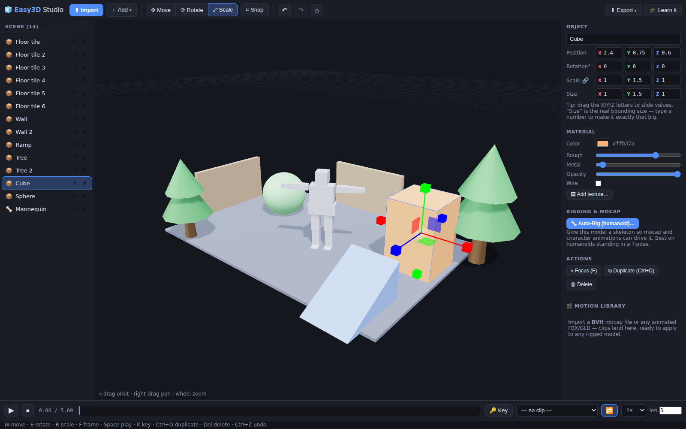

# 🧊 Easy3D Studio

**Model · build maps · animate · rig · mocap — in your browser, learnable in 10 minutes.**

Easy3D Studio is a friendly 3D editor that runs entirely in the browser. No installs, no accounts, no build step — clone, serve, create. It imports basically any 3D format, lets you resize things by dragging handles or typing exact sizes, builds maps from ready-made shapes, animates with keyframes, and — the headline act — **applies motion-capture files to any rigged model**, including models *you* rig yourself with the built-in one-click Auto-Rig.



---

## Run it

Any static file server works (the app is 100 % client-side; the three.js engine is vendored, so it even runs offline):

```bash
npm start            # → http://localhost:8080
# or
python3 -m http.server 8080
```

Or host it for free: push this repo to GitHub → **Settings → Pages → Deploy from branch** → your studio is live on the web.

> Opening `index.html` directly from disk won't work — browsers block ES modules on `file://`. Use one of the one-liners above.

---

## Learn it in 10 minutes

The app opens with an interactive guided tour (🎓 **Learn it** replays it). Here's the same tour in text:

### Minute 1–2 · Make something
- **＋ Add** → Cube / Sphere / Wall / Ramp / Tree… They drop at the center, ready to move.
- Click any object → drag the **colored arrows** to move it.
- <kbd>W</kbd> move · <kbd>E</kbd> rotate · <kbd>R</kbd> scale. In Scale mode you literally **drag the sizes**.
- **⌗ Snap** locks movement to a neat grid (0.5 units, 15°) — perfect for map building.

### Minute 3 · Exact numbers
The right sidebar shows the selection's **Position / Rotation / Scale / Size**.
- **Size** is the real bounding size in units — type `2` and the object *is* 2 units tall.
- Drag the little **X / Y / Z letters** left–right to slide any value (Shift = ×10, Alt = fine).
- 🔗 keeps proportions locked while you resize.

### Minute 4 · Import anything
Drag files **anywhere into the window** (or ⬆ Import):

| Type | Formats |
|---|---|
| Models | **GLB, GLTF** (incl. Draco), **FBX, OBJ (+MTL), STL, PLY, DAE, 3DS, 3MF, USDZ/USD** |
| Motion capture | **BVH**, plus animations inside FBX / GLB / DAE |
| Textures/extras | PNG, JPG, WEBP, TGA, BIN, MTL — drop them together with the model |

Models exported in centimeters/millimeters (looking at you, FBX) are auto-scaled to sane size and placed on the ground.

### Minute 5 · Looks
Sidebar → **Material**: color, roughness, metalness, opacity, wireframe, or **🖼 Add texture** from an image file. Edits apply to every material on the object — and everything is undoable (<kbd>Ctrl+Z</kbd>).

### Minute 6–7 · Animate
The bottom bar is a synced timeline for the whole scene.
- Imported animations appear in the **clip dropdown** — pick one, press <kbd>Space</kbd>.
- Hand-made motion: move the time cursor → pose your object → **🔑 Key** → move the cursor → pose again → **🔑**. Play. The diamonds on the bar are your keyframes (click = jump, ✕ = delete).
- Loop, ¼×–2× speed, scrubbing — all in the bar.

### Minute 8–9 · Rigging & mocap ⭐
This is the fun part.

**Apply mocap to a rigged model**
1. Import a **BVH** file (or an animated FBX/GLB — e.g. any Mixamo download). It lands in the 🎬 **Motion library** (sidebar), with a stick-figure **Preview**.
2. Select any **rigged** model and press **▶ Apply**.
3. Done. Bones are matched by name automatically — Mixamo, CMU, Rokoko, Xsens and most custom naming schemes are recognized (`LeftArm` ≈ `L_UpperArm` ≈ `mixamorig:LeftArm` …). The motion is *retargeted*: bone-length differences and rest-pose offsets are compensated, and walking motion is scaled to your character's hip height (or check *“in place”* to strip drift).
4. Weird rig? **⚙ Bone map…** shows the matching table so you can fix any pair by hand.

**Rig a model that has no skeleton**
1. Select it → sidebar → **Rigging → 🦴 Auto-Rig (humanoid)**.
2. A skeleton appears fitted to the model — drag the joint dots onto shoulders/elbows/knees (L/R mirroring is on by default). Works best on characters standing in a T-pose.
3. **✓ Bind skin** — vertex weights are computed automatically (4 influences, smooth falloff). The model is now rigged and accepts any motion from the library.

No characters at hand? **＋ Add → 🧍 Mannequin** gives you a pre-rigged test dummy.

### Minute 10 · Export
**⬇ Export** → **GLB** carries meshes, materials, skeletons *and* animations — drops straight into Unity, Unreal, Godot, Blender, or `<model-viewer>` on the web. OBJ / STL for printing and DCC tools, PNG for screenshots. (Export → GLB is also how you save your scene: re-import it later and keep working, rigs and clips included.)

---

## Keyboard cheat sheet

| Key | Action | | Key | Action |
|---|---|---|---|---|
| <kbd>W</kbd> / <kbd>E</kbd> / <kbd>R</kbd> | Move / Rotate / Scale | | <kbd>Space</kbd> | Play / pause |
| <kbd>F</kbd> | Frame selection | | <kbd>K</kbd> | Add keyframe |
| <kbd>Home</kbd> | Frame everything | | <kbd>Del</kbd> | Delete |
| <kbd>Ctrl+D</kbd> | Duplicate | | <kbd>Esc</kbd> | Deselect / cancel |
| <kbd>Ctrl+Z</kbd> / <kbd>Ctrl+Y</kbd> | Undo / Redo | | 🖱 drag / right-drag / wheel | Orbit / pan / zoom |

---

## Under the hood

- **Engine:** [three.js](https://threejs.org) r180, vendored in `vendor/three/` (MIT) — no CDN, no npm install needed to run.
- **Retargeting** (`js/retarget.js`): world-space rotation deltas per bone relative to each skeleton's rest pose, sampled at 30 fps and baked to quaternion tracks, with hip root-motion scaled by skeleton height. Works across differing hierarchies, bone lengths and rest offsets.
- **Bone matching** (`js/bonemap.js`): names are normalized (prefixes like `mixamorig:` stripped), sided (`Left`/`L_`/`.l`), and mapped to canonical humanoid slots through a synonym table (`thigh`→`upleg`, `clavicle`→`shoulder`, …) — fingers included when present.
- **Auto-rig** (`js/autorig.js`): template humanoid skeleton fitted to the model's bounds, interactive joint placement with mirroring, then distance-to-bone-segment skinning (top-4 influences, quartic falloff). Bones use standard Mixamo-style names so retargeting works instantly.
- **No framework, no bundler:** plain ES modules (`js/*.js`), one CSS file, importmap-resolved three.js.

### Tests

```bash
npm i -D playwright   # once
npm test              # headless end-to-end: boot → rig → BVH import → retarget → animate → export → GLB round-trip
```

13 checks cover the full pipeline, including re-importing an exported GLB and verifying the skeleton and animations survive the round trip.

### Where to get motion files

- [Mixamo](https://www.mixamo.com) — characters & animations (download as FBX, drop it in; both the character and its animation import).
- CMU Motion Capture Database — thousands of free BVH clips (many mirrors online).
- Any mocap suit / app that exports BVH (Rokoko, Move One, etc.).

## License

MIT for the app code. `vendor/three/` retains the three.js MIT license (included).
